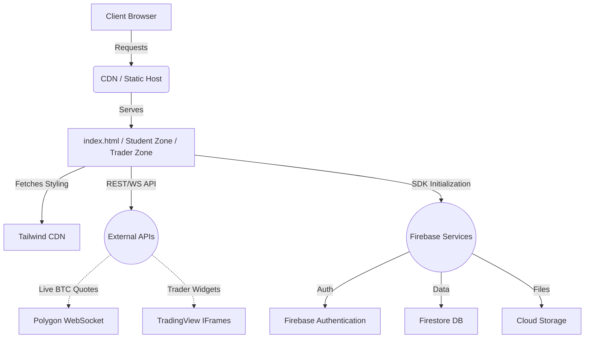
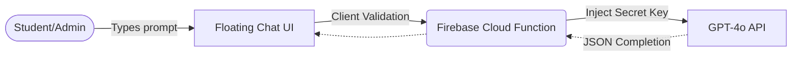

# Architecture & Scalability Guide

## 1. Static SPA Architecture (Current)

TradeSovereign is engineered as a modern, purely static **Single Page Application (SPA)-style HTML rendering methodology**, without an active NodeJS backend requirement. Instead, dynamic logic is parsed via URL parameters in vanilla JS. 

**Pros of this architecture:**
- **Zero Server Costs:** Can be hosted indefinitely on free-tier CDNs.
- **Lightning Fast LCP:** Browsers parse static DOM trees immediately.
- **SEO Friendly:** Metadata is hard-loaded in the `<head>`, perfectly readable by crawlers.

## 2. Global AI Infrastructure

## 3. Future Scalability Suggestions

As TradeSovereign grows to hundreds of thousands of concurrent users, the following refactoring milestones should be hit:

### Migration to Next.js (SSR / SSG)
- While the current architecture provides zero-latency static drops, SEO for the *dynamically appended* subjects inside `student-zone/subject.html` can be heavily improved by utilizing **Next.js Static Site Generation (SSG)**. 
- Generating `/[class]/[subject].html` physically on the server will enhance deep indexing.

### Global State Management
- Currently, UI state (`dark` mode, current class scope) relies exclusively on `localStorage`. 
- Incorporating a lightweight store like **Zustand** or **Redux** alongside React would allow for smoother transitions across complex trader datasets.

### API Proxy Layer
- Currently, API keys (AlphaVantage, OpenAI, etc.) must be hard-coded into edge functions.
- Deploying a dedicated scalable backend (e.g., Go, Node.js, or Rust) on AWS App Runner would allow you to cache heavy requests (e.g., storing a Finnhub news payload for 5 minutes instead of querying it every time a user loads the trader dashboard). This saves massive API quota costs.
